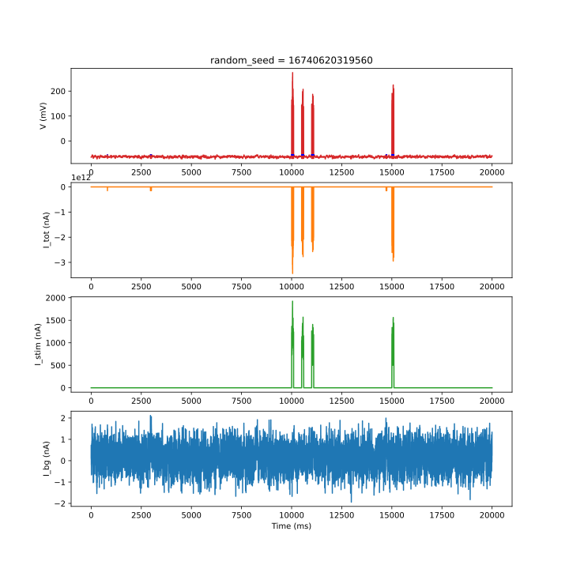

# Arbor code example: OU input to LIF neuron

This is an example to play around with, featuring a simple leaky integrate-and-fire (LIF) neuron with Ornstein-Uhlenbeck (OU) input current, implemented in Arbor. 

The OU input current can approximate the synaptic input from a population of neurons.
This is mathematically based on the diffusion approximation, which analytically describes the input current that arises from presynaptic Poisson spiking if the spiking activity is sufficiently high and the evoked postsynaptic potentials are sufficiently small compared to the threshold potential [1,2]. Moreover, the exponentially decaying autocorrelation function of the OU process resembles that of currents evoked by the spiking activity of many neocortical neurons [3].

Assuming homogeneous Poisson spiking, the mean current is `mean = N * f * w_out` and the standard deviation is `stdev = (N * f)^(1/2) * w_out` (cf. [4,5]). This is implemented as a mechanism in `ornstein_uhlenbeck_pop.mod`. A more general version is provided in `ornstein_uhlenbeck_gen.mod`.

The file `set_arbor_env` will need to be adapted to the local Arbor installation.

Execute the `build` shell script to build the custom catalogues.

Execute the `run` shell script to run the example in Python.

Tested with Arbor version 0.6.1-dev, state of commit [8af6bd2](https://github.com/arbor-sim/arbor/commit/8af6bd273678406bab7bbd0abd5c29b2d91ba6cd) (including SDE computation as of commit [5d141aa](https://github.com/arbor-sim/arbor/pull/1884/commits/5d141aae533aecb81c00cf8b26925d5dff09478e)).

### References:
[1] Ricciardi, LM. 1977. _Diffusion Processes and Related Topics in Biology_. Springer, Berlin, Germany.

[2] Moreno-Bote, R; Parga, N. 2010. Response of integrate-and-fire neurons to noisy inputs filtered by synapses with arbitrary timescales: Firing rate and correlations. _Neural Comput._ 22.

[3] Destexhe, A; Rudolph, M; Paré, D. 2003. The high-conductance state of neocortical neurons in vivo. _Nat. Rev. Neurosci._ 4.

[4] Dayan, P; Abbott, LF. 2001. _Theoretical Neuroscience_. MIT Press, Cambridge/MA, USA.

[5] Luboeinski, J; Tetzlaff, C. 2021. Memory consolidation and improvement by synaptic tagging and capture in recurrent neural networks. _Commun. Biol._ 275.
